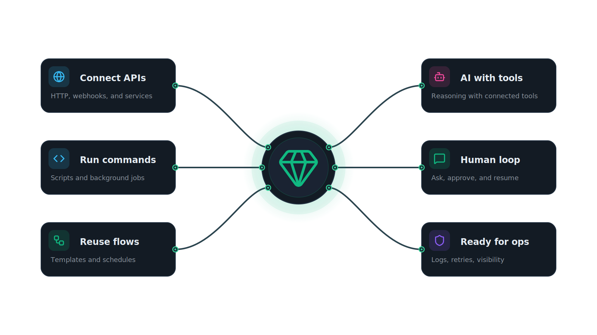

<p align="center">
  
</p>

# Emerald

Emerald is a single-binary automation platform for building visual pipelines around infrastructure, messaging, local tooling, and AI workflows. It combines a Go backend, an embedded React UI, SQLite storage, and a node-based execution engine so you can build, run, observe, and iteratively refine automations from one place.

## Highlights

- Visual pipeline editor with triggers, actions, tools, logic, and LLM nodes
- Node editor AI assistant with `Ask` and `Edit` modes for inspecting or live-editing the current unsaved canvas
- Built-in chat workspace for working directly with your configured LLM providers
- Infrastructure automation for Proxmox and Kubernetes
- Built-in HTTP, shell command, Lua, channel, and sub-pipeline execution nodes
- LLM prompt and agent nodes with connected tool nodes
- Workspace skill loading from the nearest `.agents/skills`, with optional override support
- Reusable templates with JSON import/export
- Live execution tracking over websocket
- Built-in authentication with user management

## What You Can Build

- Run scheduled jobs with cron-based pipelines
- Trigger automations from connected Telegram or Discord chats
- Start, stop, clone, and inspect Proxmox workloads
- Inspect, patch, apply, restart, scale, and troubleshoot Kubernetes resources
- Call external APIs, run local shell commands, and execute Lua scripts
- Chain pipelines together and return structured data between them
- Give LLM agents access to infrastructure, shell, HTTP, channel, and pipeline tools
- Chat with your configured LLM providers in the built-in chat workspace
- Ask questions about a pipeline or apply live graph edits from the node editor assistant before saving

## Node Categories

### Triggers

- Manual trigger
- Cron trigger
- Channel message trigger

### Actions

- Proxmox: list nodes, list VMs/CTs, start VM, stop VM, clone VM
- Kubernetes: API resources, list/get resources, apply manifests, patch, delete, scale, rollout restart/status, pod logs, pod exec, events
- Local actions: HTTP request, shell command, Lua script
- Messaging: send message, reply, edit message, send and wait
- Pipelines: get pipeline, run pipeline

### Tools For LLM Agents

- Proxmox tools
- Kubernetes tools
- HTTP and shell tools
- Pipeline list/get/create/update/delete/run tools
- Channel send-and-wait tool

### Logic

- Condition
- Switch
- Merge
- Aggregate
- Return

### LLM

- Prompt node
- Agent node

## Supported Integrations

- Proxmox VE clusters
- Kubernetes clusters via kubeconfig data
- Telegram bots
- Discord bots
- OpenAI
- OpenRouter
- Ollama
- Custom OpenAI-compatible LLM endpoints

## AI Experiences

### Chat Workspace

- Persistent browser conversations with your configured LLM providers
- Stop in-flight responses when you want to interrupt generation
- Local workspace skills are summarized into chat context and can be loaded on demand through the built-in `get_skill` tool
- Shared base instructions and built-in knowledge modules are configurable in `Settings -> AI -> Assistants -> Chat Window`

### Node Editor Assistant

- Open the circular brain button at the bottom of the editor to launch the assistant panel
- `Ask` mode is read-only and answers questions about the current unsaved pipeline snapshot from the browser
- `Edit` mode can propose and apply validated live graph operations directly to the in-memory canvas
- Live edits stay in the UI until the user saves the pipeline
- During `Edit` requests, the canvas is temporarily locked from manual changes while the assistant remains interactive
- Shared base instructions and built-in graph knowledge modules are configurable in `Settings -> AI -> Assistants -> Node Editor`

## Quick Start

### Prerequisites

- Go 1.26+
- Node.js 20+
- npm
- `make`
- A CGO-capable C toolchain for `go-sqlite3`

### Run Locally

```bash
make build
make run
```

Open [http://localhost:8080](http://localhost:8080).

Default login credentials for a fresh database:

- Username: `admin`
- Password: `admin`

Change the default password after the first login in `Settings -> Users`.

## Docker

Run with Docker Compose:

```bash
docker compose up --build -d
```

The compose file stores SQLite data in the `emerald-data` named volume and exposes the app on port `8080`.
It also stores the container-local `.agents` directory in the `emerald-agents` named volume so bundled/default skills and any custom workspace skills persist across restarts.

Published images are expected at:

```text
ghcr.io/flameinthedark/emerald:<tag>
ghcr.io/flameinthedark/emerald:latest
```

## Configuration

Emerald reads configuration from environment variables. The variable names currently retain the `AUTOMATOR_*` prefix for compatibility.

| Variable | Default | Description |
|----------|---------|-------------|
| `AUTOMATOR_PORT` | `8080` | HTTP server port |
| `AUTOMATOR_DB_PATH` | `./emerald.db` | SQLite database path |
| `AUTOMATOR_AUTH_USERNAME` | `admin` | Username ensured at startup when it does not already exist |
| `AUTOMATOR_AUTH_PASSWORD` | `admin` | Password used when creating the configured bootstrap user |
| `AUTOMATOR_AUTH_SESSION_TTL_HOURS` | `24` | Session lifetime in hours |
| `AUTOMATOR_AUTH_COOKIE_NAME` | `emerald_session` | Authentication cookie name |
| `AUTOMATOR_ENCRYPTION_KEY` | empty | Optional 32-character key used to encrypt stored secrets |
| `AUTOMATOR_SKILLS_DIR` | empty | Optional override for the local skills directory used by chat and agent experiences |

Notes:

- If `AUTOMATOR_ENCRYPTION_KEY` is not provided, Emerald generates one on first boot and stores it in the database.
- Stored secrets include items such as cluster credentials, channel tokens, and LLM provider keys.
- `AUTOMATOR_HOST` exists in config today but is not currently used by the server listener.
- If `AUTOMATOR_SKILLS_DIR` is not set, Emerald searches upward from the current working directory and server executable location for the nearest `.agents/skills`, then falls back to `./.agents/skills`.

## Development

Build the embedded frontend and server:

```bash
make build
```

Run the backend with the embedded frontend bundle:

```bash
make run
```

Work on the frontend separately with Vite:

```bash
cd web
npm ci
npm run dev
```

Useful commands:

```bash
make build-web  # build the React app into internal/api/web/dist
make build      # build frontend + Go server binary
make run        # run the server
make test       # go test -race -cover ./...
make lint       # golangci-lint run
make clean      # remove built binary and embedded frontend dist
make docker     # build Docker image
make docker-run # start docker-compose stack
```

## Local Skills

Emerald can load repository-local skills for chat and agent workflows.

- Put skills under `.agents/skills/<skill-name>/SKILL.md`
- Skills are refreshed automatically while the server is running
- The chat workspace can see available skills and request the full body of a skill through the built-in `get_skill` tool
- LLM agent nodes can use the same local skill store
- Set `AUTOMATOR_SKILLS_DIR` if you want Emerald to use a different skills directory

## Project Layout

```text
cmd/server            server entrypoint
internal/api          Fiber API, handlers, auth middleware, embedded web assets
internal/node         node registry and node implementations
internal/pipeline     execution engine, runtime, validation, sub-pipelines
internal/db           SQLite models, queries, and migrations
internal/llm          provider clients, tools, and chat helpers
internal/channels     Telegram and Discord integrations
web                   React + Vite frontend
```

## Releases

GitHub Actions is configured to publish:

- Linux amd64 archives
- Windows amd64 archives
- macOS arm64 archives
- `SHA256SUMS.txt`
- GHCR container images

The release flow is driven by semantic-release on pushes to `main` or `master`.

## Current Notes

- Authentication sessions are stored in memory, so restarting the server signs users out.
- Only active pipelines participate in cron scheduling and channel-triggered execution.
- Manual runs work even when a pipeline is inactive.
- Tool nodes are only meaningful when connected to an `llm:agent` node.
- Local skills are resolved from the nearest workspace `.agents/skills` by default and refreshed automatically.
- A webhook trigger node exists in the editor/runtime model, but there is currently no public HTTP webhook route wired in the API.

## License

MIT
